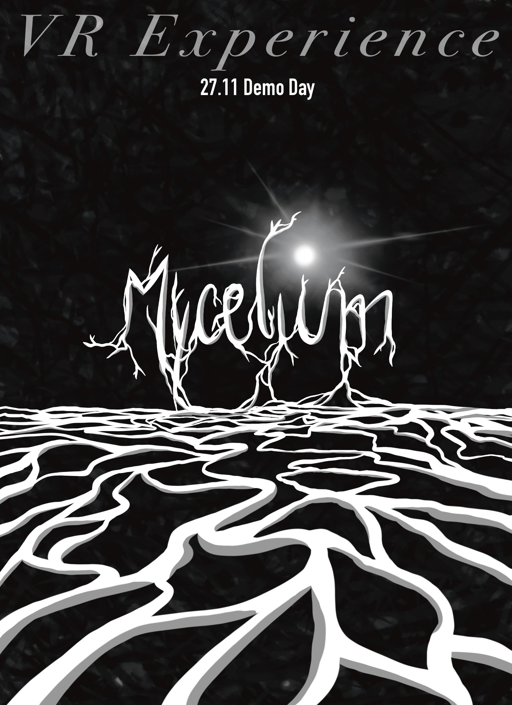

# Mycelium-vr
Groupwork for the Aalto University course Designing and Creating Virtual Worlds

### Each experience generates a unique path.
<video src="./Doc/Videos/Opening.mp4" autoplay loop muted></video>

### Progressing through the experience.
<video src="./Doc/Videos/Movement.mp4" autoplay loop muted></video>

### At the journey's end, the traversed path becomes visible.
<video src="./Doc/Videos/TheEnd.mp4" autoplay loop muted></video>
